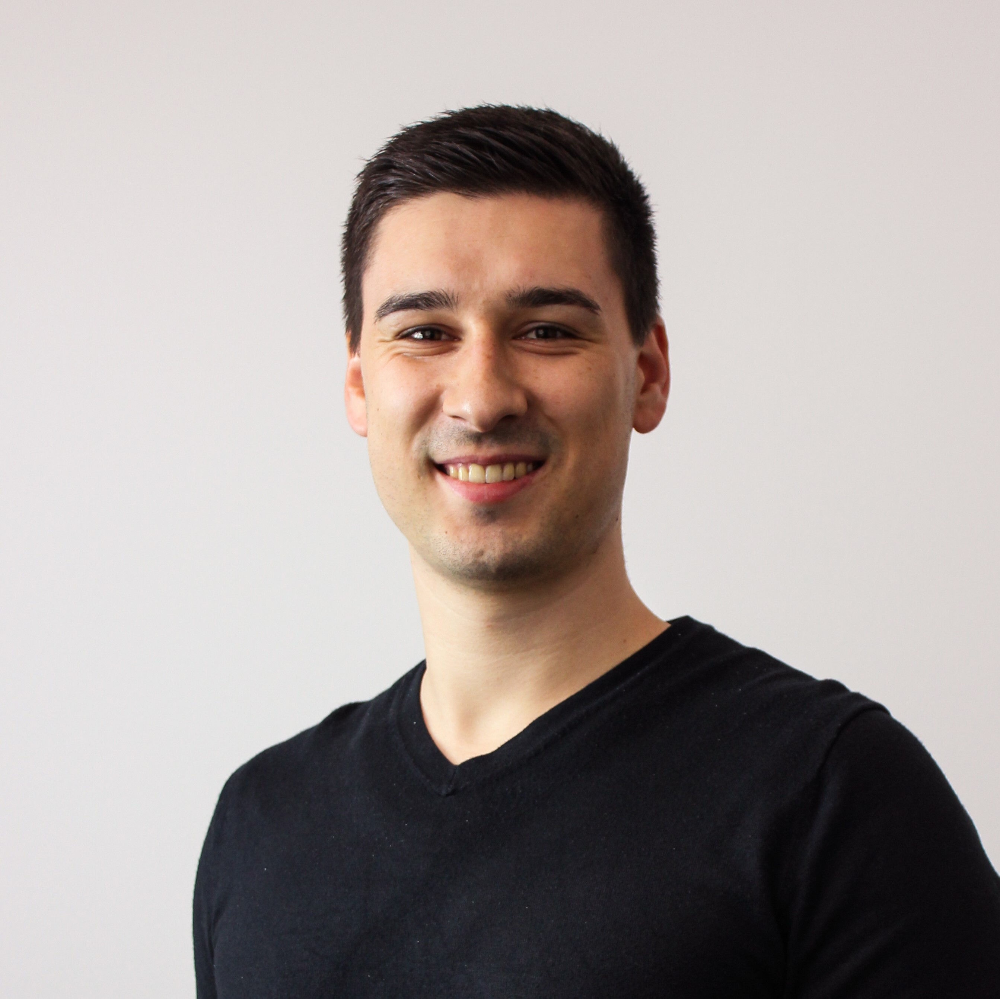
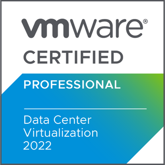
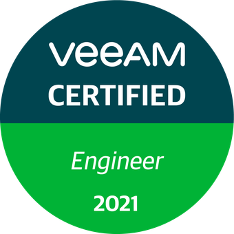
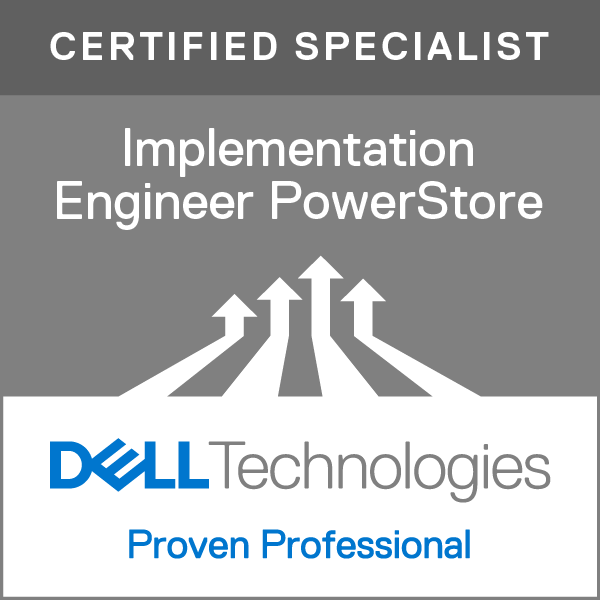
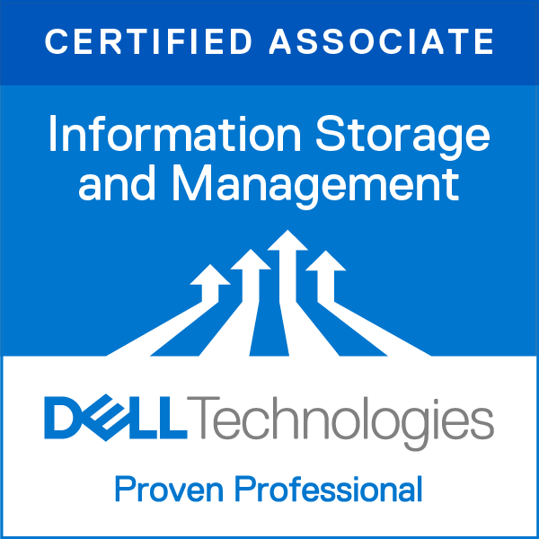

---
hide:
  - navigation
  - toc
  - footer
---

#Über mich

{ .avatar .skip-lightbox}

**Peter Sommer**  
:fontawesome-solid-location-dot: Frankfurt(Main)
|
:fontawesome-brands-linkedin: [LinkedIN](https://www.linkedin.com/in/peter-sommer-3170a8139/)
|
:material-office-building-outline: Medialine AG

## IT Consultant für **Datacenter**, **Virtualisierung**, and **Cloud Infrastruktur**

Ich bin Peter Sommer, ein leidenschaftlicher IT-Consultant mit über 8 Jahren Erfahrung in der Planung, Umsetzung und Optimierung moderner IT-Infrastrukturen. Aktuell liegt mein Fokus auf hybriden Datacenter-Lösungen unter der Verwendung von Microsoft Azure Hybrid.

### :octicons-gear-24: Expertise

- Microsoft Virtualisierung (Hyper-V, Storage Spaces Direct)
- Microsoft Azure Local (vormals Azure Stack HCI)
- Microsoft Azure ARC
- Microsoft Windows Server Infrastruktur Dienste
- Veeam Backup und Recovery
- Sophos UTM/XG
- Dell Server und Storage (PowerEdge, AX, APEX/MC)
- Dell Network OS9, OS10
- Ubiquiti Unifi

### :material-certificate-outline: Zertifizierungen
- Dell Integrated System for Microsoft Azure Stack HCI Deployment
- Microsoft Certified: Azure Fundamentals (AZ-900)
- VMware Certified Professional - Data Center Virtualization 2022 (VCP-DCV 2022)
- VMware Certified Professional - Data Center Virtualization 2021 (VCP-DCV 2021)
- Veeam Certified Engineer 2021 (VMCE 2021) v11
- DEA-1TT4 - Associate - Information Storage and Management Version 4.0
- DES-1221 - Specialist - Implementation Engineer, PowerStore Solutions
- Sophos Central Endpoint and Server - Engineer
- Sophos XG Firewall - Engineer
- Sophos UTM - Engineer

{ .badge }
{ .badge }
{ .badge }
{ .badge }
{ .badge }
{ .badge }

