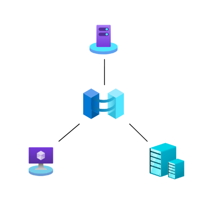
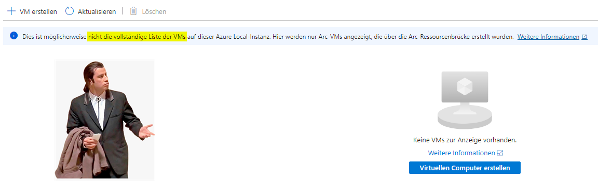
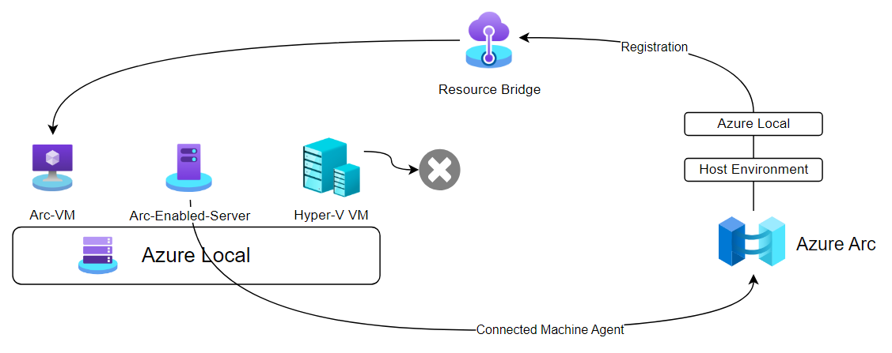

# Hyper-V VMs, Azure Arc-VMs und Azure Arc-enabled Servers: Unterschiede und Backup-Strategien

{ align=left width="200" .rounded-image }

Wer **Azure Local (vormals Azure Stack HCI)** einsetzt wurde spätestens mit der Version 23H2 mit verschiedenen VM-Typen konfrontiert. Auch die Frage warum meine VM auf einmal nicht im Azure Portal sichtbar ist oder auch nur an einer anderen Stelle bekomme ich oft gestellt. In folgendem Artikel möchte ich einen Überblick der möglichen VM-Typen in Bezug auf **Azure Local** und **Azure Arc** aufzeigen. Zusätzlich sollte bei **Backup und Recovery** verschiedene Besonderheiten beachtet werden.

<!-- more -->

 

 

{ align=left }

 

## Übersicht

### 1. Hyper-V VMs
Diese VMs werden **nicht** im Azure Portal innerhalb des Clusterobjekt angezeigt.

- Werden vollständig **On-Premises** in **Hyper-V/Azure Local** erstellt und verwaltet.  
- **Verwaltungstools**: Hyper-V Manager, PowerShell, Failover-Cluster-Manager oder SCVMM.  
- **Backup und Recovery** sind mit gängigen Tools (z.B. Veeam, Commvault, MABS,..) uneingeschränkt möglich.

### 2. Azure Arc-VMs
Arc-VMs werden innerhalb des Azure Local Clusterobjekt im Azure Portal angezeigt und besitzen erweiterte Verwaltungsmöglichkeiten.

- VMs die über die **Azure Arc Resource Bridge** mit Azure verbunden und Registriert sind.  
- **Zentrale Verwaltung und Überwachung** über das Azure-Portal.  
- **Bereitstellung** derzeit ausschließlich über das Azure-Portal oder Azure Migrate möglich.

### 3. Azure Arc-enabled Servers
Unabhängig der Hostumgebung werden die Server oder VMs unter den Azure Arc Ressourcen als Machine gelistet.

- **Physische Server oder externe VMs**, auch solche, die nicht in Azure laufen.  
- Verbindung zu Azure erfolgt über den **Azure Connected Machine Agent** im Windows oder Linux Betriebssystem.  
- Können auch Hyper-V VMs sein, die für **Azure-Management und -Überwachung** verbunden werden.

!!! tip "Azure Connected Machine Agent"
    Das Verbinden von Windows oder Linux Workloads mit Azure Arc ist ohne Kosten verbunden. Wer eine Zentrale Übersicht und Verwaltung seiner Server erzielen möchte, kann dies einzeln oder auch mittels Skript, GPO, Ansible usw. unkompliziert umsetzen. Ab Windows Server 2022 ist bereits ein Wizard zum vereinfachten Onboarding im Betriebssystem enthalten.

{ align=left }

## Backup und Wiederherstellung in hybriden Umgebungen

Backup-Tools von Drittanbietern bieten robuste Lösungen für Hyper-V VMs. Für Azure Arc-VMs ergeben sich jedoch neue Herausforderungen:

- **Wiederherstellung bestehender Azure Arc-VMs:**  
  - Wird eine gesicherte **Azure Arc-VM** wiederhergestellt und die bestehende VM überschrieben, bleibt die **Verbindung zur Azure Arc Resource Bridge** erhalten.  
  - Wird eine VM jedoch als neue Instanz wiederhergestellt oder so überschrieben, dass die Verbindung zu Azure **getrennt** wird, entsteht eine **traditionelle Hyper-V VM**.

- **Konvertierung in Azure Arc-VMs:**  
  - Aktuell gibt es **keine Möglichkeit**, eine wiederhergestellte Hyper-V VM in eine Azure Arc-VM zu konvertieren.  
  - Ein Workaround kann eine lokale "Migration" mittels **Azure Migrate** darstellen.

## Fazit

Das Verständnis der Unterschiede zwischen **Hyper-V VMs**, **Azure Arc-VMs** und **Azure Arc-enabled Servers** ist essenziell, um eine effektive Backup- und Wiederherstellungsstrategie zu entwickeln sowie das VM-Management im Überblick zu behalten.  

- **Backup- und Recovery-Tools** sind weiterhin eine zuverlässige Option für Hyper-V VMs.  
- Die Integration von **Azure Arc-VMs** bringt spezifische Anforderungen und Einschränkungen mit sich.  
